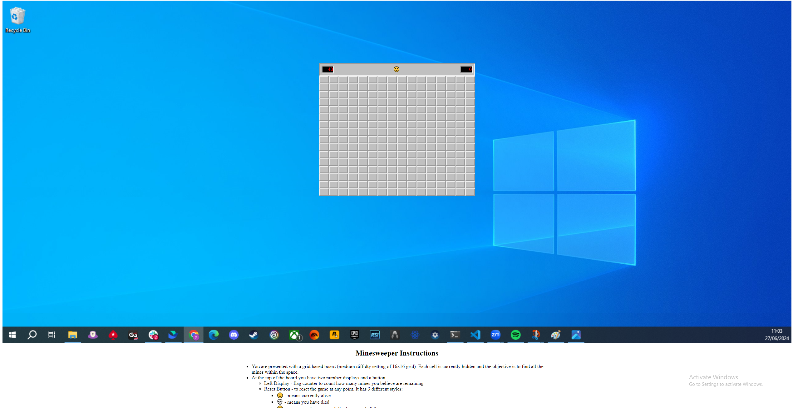
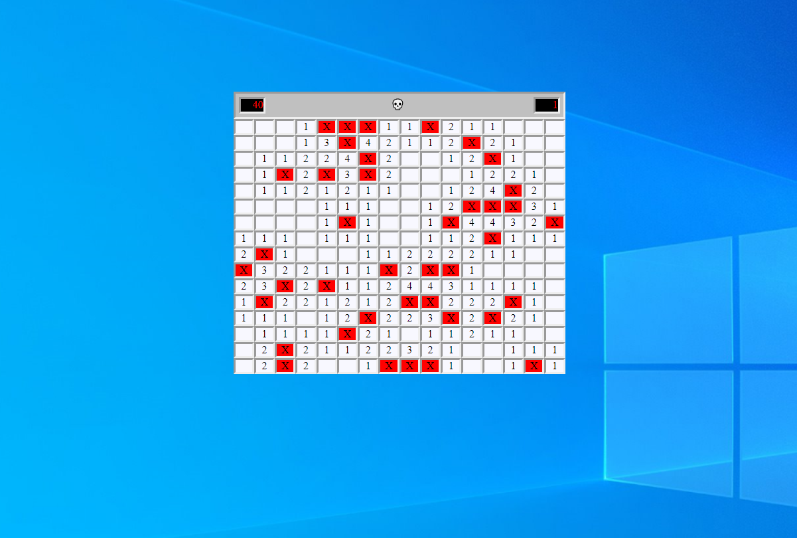
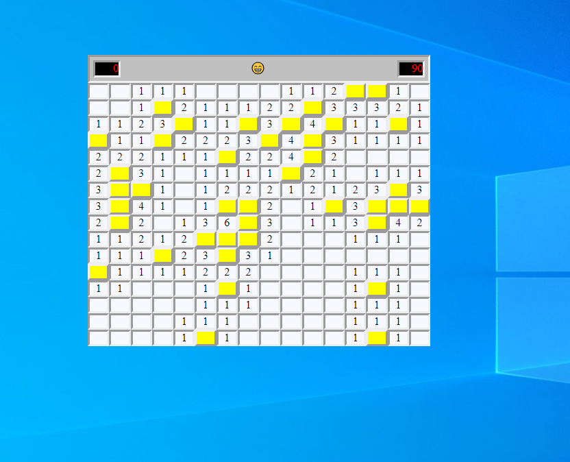

## General Assembly - Mine Sweeper Project

Mine Sweeper is a classic Windows game where the objective is to clear a board of mines. The players aim is to flag

## Playable link

## Project Overview

## Project planning

Planning document used to help guide the game implementation.
Certain aspects of implementation did differ from the planning document:
    - Not all functions were thought about before
    - 1D vs 2D array for the board, I originally chose a 2D but changed early on

## Technologies

### HTML

### CSS

### JavaScript

## Game States

### On Load

Initial game state

### On Death

Game state on death

### On Win

Game state on win

## Take Aways
Overall this was a great project that provided a range of challenges and learning opportunities. It was hard enough to be interesting but not so hard that I was constantly stuck and asking for help from the tutors.

### Learnings
- The importance of not only project planning but how functions interact with each other and choosing the correct order of implementation
- Dynamic HTML from JavaScript
- CSS Styling:
    - Flexboxes
    - Effective use of classes to change visual states

### Challenges
- Project structure and order of implementation:
    - As I went through it became clear early choices made future implementation of things more difficult
- Floodfill:
    - General implementation and boundary limitation
- Styling:
    - CSS is generally my weakest area so most of my time doing this I spent googling answers

### Improvements:
- Add a board size selector 
    - Small (8x8 10 mines), Medium (16x16 40 mines), Hard (30x16 99 mines)
- Add a difficulty selector, this will vary the number of mines based on a percentage increase/decrease for Hard and Easy
    - Medium is the current default.
    - Easy reduce mine number by 30%
    - Hard increase mine number by 30%
- Better visuals:
    - Mines and Flags be images
        - Different variations of the mines: the one that killed you, ones with correctly placed flags, unfound mines.
        - Different variations of flags: incorrectly placed, correctly placed.
- More robust win condition

### Bugs
- No obvious bugs, but there is a way to "cheese" the win condition.